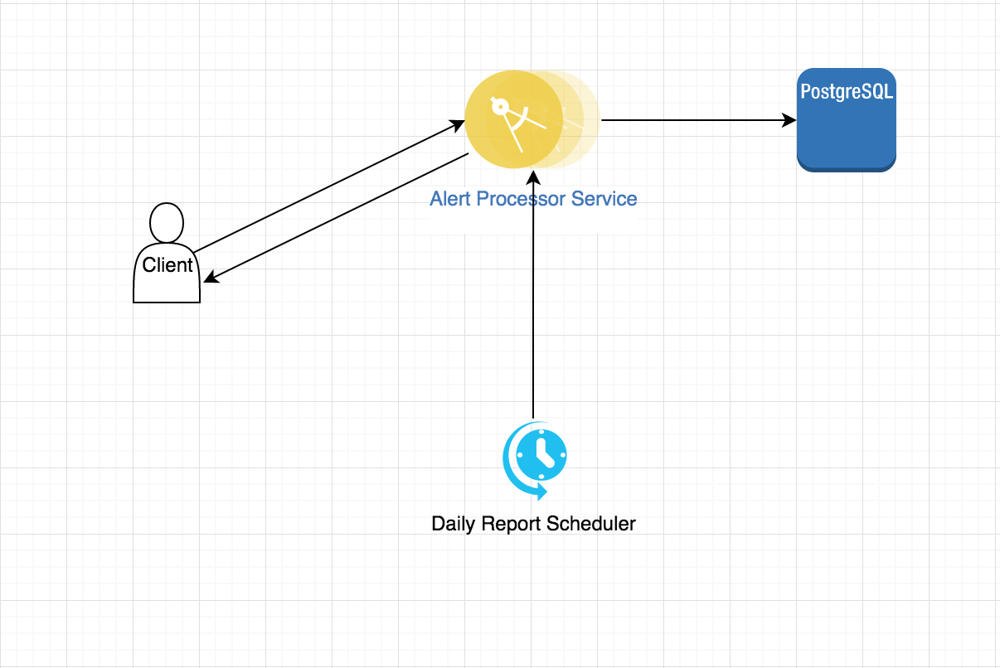
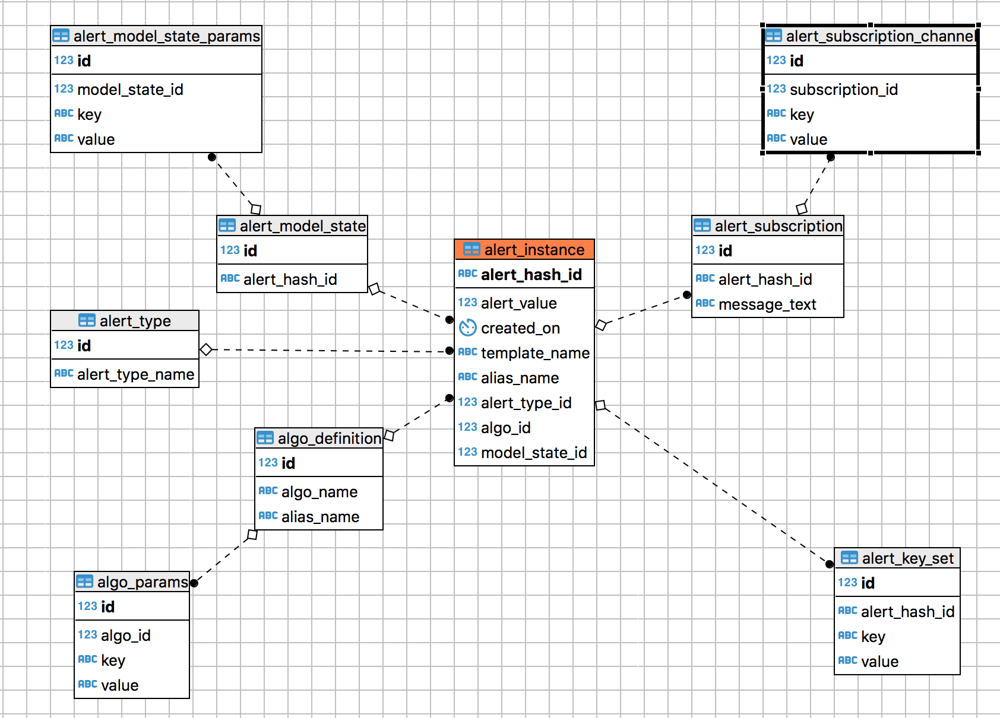

# AlertProcessor Service
  Alert processor service is is a micro-service indented to generate 
alert report based on selected criteria. This service follows Restful 
architecture and is written in Java using Drop-wizard framework. Alert 
instances are stored in the backed in a PostgreSql database.

## Architecture
#### Daigram


#### API Contract

(POST)

/api/alerts/report?startTime=&endTime=

**Headers:<br/>**
Content-Type = application/json<br/>
(Signing headers are to be added while enabling API Signing)

**Request Body Parameters:<br/>**
```
{
    "anomaly_template_alias" : anomaly template alias name (Required: True),
     "key_set": {
        "key1" : [value1, value2] (Optional True),
        "key2" : [value1, value2] (Optional True)
    }
}
```

#### ER Diagram


## Setup
To be filled.